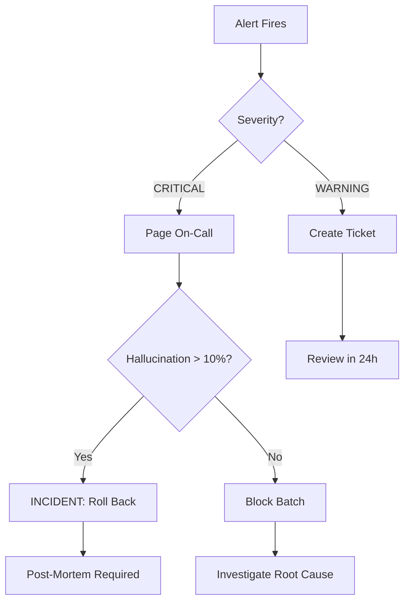

# Ashwam Monitor

Production monitoring framework for the Ashwam journaling parser. Detects model/prompt drift and unsafe behavior without ground truth labels.

> **Exercise C — Production Monitoring Without Ground Truth**

## Table of Contents

- [Overview](#overview)
- [Quick Start](#quick-start)
- [CLI Commands](#cli-commands)
- [Output Reports](#output-reports)
- [Invariants (Hard Checks)](#invariants-hard-checks)
- [Drift Detection](#drift-detection)
- [Canary Testing](#canary-testing)
- [Human-in-the-Loop](#human-in-the-loop)
- [Explainability](#explainability)
- [Running Tests](#running-tests)
- [Project Structure](#project-structure)
- [Structured Responses](#structured-responses)

---

## Overview

Ashwam processes free-form women's health journals across symptoms, food, emotion, and mind domains. The parser uses an LLM under the hood, which can be unpredictable. This tool monitors parser outputs and alerts when things go wrong.

**Key constraints:**
- No canonical labels for symptoms, food, emotion, or mind
- LLM outputs may drift over time (prompt changes, model updates, distribution shift)
- Safety and restraint matter more than recall

---

## Quick Start

### 1. Clone the Repository

```bash
git clone https://github.com/Fatal777/ashwam-ml-ai-intern-saad-ilkal.git
cd ashwam-ml-ai-intern-saad-ilkal
```

### 2. Install Dependencies

```bash
pip install -r requirements.txt
```

**Requirements:**
- Python 3.10+
- click
- pydantic
- numpy
- scipy

### 3. Run the Full Monitoring Suite

```bash
python -m ashwam_monitor run --data ./data --out ./out
```

### 4. Generate Dashboard (Markdown)

```bash
python -m ashwam_monitor run --data ./data --out ./out --format markdown
```

### 5. View Human Review Queue

```bash
python -m ashwam_monitor review-queue --invariant-report ./out/invariant_report.json
```

---

## CLI Commands

> **Important:** All commands must start with `python -m ashwam_monitor`. The subcommands (`run`, `drift`, etc.) and flags (`-d`, `-o`, etc.) cannot be used standalone.

**Command structure:**
```
python -m ashwam_monitor <subcommand> <options>
│                        │            │
│                        │            └── flags like --data, -d, --out, -o
│                        └── one of: run, invariants, drift, canary, review-queue
└── always required - this runs the module
```

### Available Subcommands

| Subcommand | Description |
|------------|-------------|
| `run` | Full monitoring suite (invariants + drift + canary) |
| `invariants` | Check hard rules only |
| `drift` | Compare two output sets |
| `canary` | Evaluate against gold labels |
| `review-queue` | Show items needing human review |
| `analyze` | **Advanced analysis** with diff viz, auto-diagnosis, timeline, confidence intervals |

### Complete Examples

**Run full monitoring:**
```bash
python -m ashwam_monitor run --data ./data --out ./out
```

**Run with short flags:**
```bash
python -m ashwam_monitor run -d ./data -o ./out -v
```

**Check invariants only:**
```bash
python -m ashwam_monitor invariants --outputs ./data/parser_outputs_day1.jsonl --journals ./data/journals.jsonl
```

**Compare drift between days:**
```bash
python -m ashwam_monitor drift --baseline ./data/parser_outputs_day0.jsonl --current ./data/parser_outputs_day1.jsonl
```

**Run canary evaluation:**
```bash
python -m ashwam_monitor canary --canary-dir ./data/canary --outputs ./data/parser_outputs_day1.jsonl
```

**View human review queue:**
```bash
python -m ashwam_monitor review-queue --invariant-report ./out/invariant_report.json
```

**Run advanced analysis (wow factor):**
```bash
python -m ashwam_monitor analyze --data ./data --out ./out
```
This generates: diff visualization, auto-diagnosis, alert timeline, confidence intervals, and human review sheet.

### Options Reference

Run `python -m ashwam_monitor run --help` to see all options:

```
Options:
  -d, --data PATH               Data directory with journals and parser outputs [required]
  -o, --out PATH                Output directory for reports
  -b, --baseline TEXT           Baseline parser outputs file (default: parser_outputs_day0.jsonl)
  -c, --current TEXT            Current parser outputs to check (default: parser_outputs_day1.jsonl)
  -v, --verbose                 Show debug info
  -f, --format [json|markdown]  Output format: json (default) or markdown (PM view)
  --dry-run                     Preview mode: run checks without writing files
  --log                         Enable file logging to out/logs/
  --store-history               Store run in SQLite database for trend analysis
```

---

## Output Reports

After running, these reports are generated:

```
out/
├── invariant_report.json    # Hallucinations, contradictions, schema issues
├── drift_report.json        # Day0 vs Day1 comparison
├── canary_report.json       # Gold label evaluation results
├── summary.json             # High-level summary
├── dashboard.md             # Markdown dashboard for stakeholders
├── advanced_analysis.json   # Diff viz, diagnosis, timeline, confidence (from analyze)
├── human_review_sheet.md    # Clinician-ready review checklist (from analyze)
├── run_history.db           # SQLite database for trend analysis (--store-history)
└── logs/                    # Log files (--log)
    └── monitor_YYYYMMDD.log # Daily structured logs
```

> **Note:** Reports are **regenerated fresh** each time you run the command. They reflect the current state of your data, not a historical snapshot. Think of it like `git status` - it shows you the state at that moment.

---

## Invariants (Hard Checks)

These are hard rules that should **never** fail in production:

| Invariant | Description | Threshold | Failure Action |
|-----------|-------------|-----------|----------------|
| Schema Validity | % of outputs with valid JSON schema | ≥ 95% | Block batch, alert engineering |
| Evidence Validity | % of items whose evidence_span exists in source | ≥ 90% | Queue for clinician review |
| Hallucination Rate | % of items with fabricated evidence | ≤ 5% | Escalate to clinical review |
| Contradiction Rate | Same evidence with conflicting polarity | ≤ 1% | Flag for human review |

**Why these exist:**
- Fabricated health data can cause anxiety or incorrect self-care decisions
- Contradictions destroy user trust ("cramps present" AND "cramps absent")
- Schema failures break downstream features

---

## Drift Detection

Compares baseline (Day 0) to current (Day 1) and flags significant changes:

| Metric | What It Measures | Normal Range |
|--------|------------------|--------------|
| Extraction Volume | Items per journal | 1-2 items, zero_rate < 10% |
| Uncertainty Rate | Unknown/low confidence items | < 40% |
| Domain Mix | Distribution across symptom/food/emotion/mind | symptom 30-40%, food 20-30%, emotion 20-30%, mind 10-20% |
| Arousal Distribution | Low/medium/high arousal ratio | low 30-40%, medium 30-40%, high 20-30% |
| Intensity Distribution | Low/medium/high intensity ratio | low 20-30%, medium 40-50%, high 20-30% |

**Statistical methods used:**
- **Jensen-Shannon Divergence** - Symmetric measure for categorical distributions
- **Kolmogorov-Smirnov Test** - Detects shape changes in confidence distributions

---

## Canary Testing

A small labeled set (5 journals) used for post-deployment validation.

| F1 Score | Action | Rationale |
|----------|--------|-----------|
| ≥ 0.70 | PASS | Healthy system |
| 0.60-0.70 | ALERT | Monitor closely |
| 0.50-0.60 | HUMAN_REVIEW | Clinicians must review |
| < 0.50 | ROLLBACK | Revert to previous model |

**Run frequency:** Every deployment + every 6 hours

---

## Human-in-the-Loop

Not everything can be automated. A priority queue handles items needing human review:

- **Priority scoring:** severity × age × (1 - confidence)
- **Critical items:** Always reviewed regardless of daily limit
- **Daily batch limit:** 30 items (prevents clinician burnout)
- **Escalation:** Items pending > 24 hours get escalated

**What humans review:**
- Hallucinations (high severity)
- Contradictions
- Low-confidence extractions

**What humans do NOT review:**
- Valid extractions with high confidence
- Routine schema-valid outputs

See `ashwam_monitor/human_loop/workflow.py` for the complete design document.

---

## Explainability

Role-based explanations for different stakeholders:

| Audience | Focus | Format |
|----------|-------|--------|
| **PM** | System health, trends, risk signals | `dashboard.md` |
| **Clinician** | Evidence grounding, uncertainty, limitations | Detailed violation reports |
| **User** | High-level, non-alarming, trust-preserving | Simple status indicators |

Generate PM dashboard:
```bash
python -m ashwam_monitor run --data ./data --out ./out --format markdown
```

---

## Advanced Analytics

Run the `analyze` command for deeper insights:

```bash
python -m ashwam_monitor analyze --data ./data --out ./out
```

### Features

#### 1. Diff Visualization
Shows exactly what changed between baseline and current:
```
arousal_distribution: 0.5 → 1.0 (+100.0%) ⬆️⬆️ 🔴 BREAKAGE
  └─ JSD: 0.2158
intensity_distribution: 0.667 → 0.455 (-31.8%) ⬇️⬇️ 🟡 DRIFT
```

#### 2. Auto-Diagnosis
Automatically identifies root causes:
```
🔍 Patterns detected: 3
  • systematic_hallucination: 'intrusive thoughts' appears 6 times
  • polarity_confusion: Parser extracting same evidence with opposite polarity

💡 Likely causes:
  → Parser prompt may contain 'intrusive thoughts' as example

🔧 Recommended actions:
  ✓ Review parser prompt for leading examples
  ✓ Add negation examples to prompt training
```

#### 3. Confidence Intervals (95%)
Statistical rigor for all metrics:
```
hallucination_rate: 20.0% ± 13.9%
📊 Interpretation: Statistically significant - exceeds threshold even at lower CI bound
```

#### 4. Simulated Alert Timeline
Shows how alerts would progress over time:
```
Day 1: ✅ GREEN - System initialized with baseline
Day 3: 🟡 YELLOW - Uncertainty rate elevated
Day 5: 🔴 RED - Hallucination spike detected
Day 7: ✅ GREEN - Rollback complete
```

#### 5. Human Review Sheet
Generates a ready-to-use clinician checklist (`human_review_sheet.md`):
- Journal context for each violation
- Approve/Reject/Unclear checkboxes
- Notes section
- Summary table

---

## Running Tests

```bash
python -m pytest tests/ -v
```

**Test coverage:**
- 25 tests covering invariants, metrics, and integration
- Tests for hallucination detection, contradiction checking, schema validation
- Statistical tests for drift detection (JSD, KS test)

---

## Production Operations

### Alert Runbook

When alerts fire, follow this escalation path:

| Alert | Severity | Immediate Action | Escalate To |
|-------|----------|------------------|-------------|
| `hallucination rate > 5%` | 🔴 CRITICAL | Block batch, page on-call | Engineering + Clinical |
| `hallucination rate > 10%` | 🔴 CRITICAL | **INCIDENT** - Roll back parser | VP Engineering |
| `contradiction rate > 1%` | 🔴 CRITICAL | Flag all contradictions for human review | Clinical team |
| `canary F1 < 0.5` | 🔴 CRITICAL | Roll back to previous model | Engineering |
| `canary F1 < 0.6` | 🟡 WARNING | Human review, monitor closely | Engineering |
| `domain surge > 15%` | 🟡 WARNING | Investigate prompt changes | ML team |
| `arousal collapse` | 🟡 WARNING | Check emotion parsing logic | ML team |

### Escalation Flowchart



### Recovery Procedures

**If hallucinations spike:**
1. Check if parser prompt was recently changed
2. Compare Day 0 vs Day 1 outputs manually for 5 samples
3. Look for systematic patterns (same evidence span appearing multiple times)
4. If model update caused it → roll back
5. If prompt change caused it → revert prompt

**If canary F1 drops:**
1. Run `--dry-run` to see current state without side effects
2. Check if gold labels are still valid
3. Compare per-journal breakdown for specific failures
4. Investigate parser confidence distributions

---

## Performance Characteristics

### Time Complexity

| Component | Complexity | Notes |
|-----------|------------|-------|
| Evidence checking | O(n × m) | n=items, m=avg journal length |
| Contradiction detection | O(n²) | Pairwise comparison within journal |
| Drift metrics | O(n) | Single pass through items |
| Statistical tests (JSD/KS) | O(k log k) | k=number of categories |
| Overall per batch | O(n × m) | Dominated by evidence checking |

### Benchmarks (approximate)

| Batch Size | Journals | Total Items | Runtime |
|------------|----------|-------------|---------|
| Small | 20 | 30 | ~200ms |
| Medium | 100 | 200 | ~1s |
| Large | 1000 | 2000 | ~10s |

### Memory Usage

- Loads all journals into memory as dict (journal_id → text)
- Loads all parser outputs into memory
- For 1000 journals × 1KB avg = ~1MB base memory
- Peak memory ≈ 3× base (reports + intermediate data structures)

### Scaling Considerations

- **Current design:** Batch processing, single-threaded
- **For 10K+ journals:** Would need streaming or chunked processing
- **For real-time:** Would need Redis queue + worker architecture

---

## Week 1 Launch Checklist

### Pre-Launch (Day -1)
- [ ] Run full monitoring on production-like data
- [ ] Verify all thresholds are appropriate for your data
- [ ] Set up alerting webhooks (Slack/PagerDuty)
- [ ] Document on-call runbook
- [ ] Baseline Day 0 outputs saved

### Day 1
- [ ] Run monitoring with `--dry-run` first
- [ ] Check for any CRITICAL alerts
- [ ] Review first batch of human review items
- [ ] Monitor canary F1 closely

### Day 2-7
- [ ] Track drift metrics daily
- [ ] Tune thresholds based on false positive rate
- [ ] Review escalation queue
- [ ] Document any new failure patterns

---

## Project Structure

```
ashwam_monitor/
├── invariants/         # Schema, evidence, contradiction checks
│   ├── evidence_checker.py
│   ├── contradiction_checker.py
│   ├── schema_checker.py
│   └── runner.py
├── metrics/            # Drift detection and statistics
│   ├── statistical.py
│   ├── extractors.py
│   └── comparator.py
├── canary/             # Gold label evaluation
│   ├── matcher.py
│   ├── evaluator.py
│   ├── actions.py
│   └── runner.py
├── human_loop/         # Review queue design
│   ├── queue.py
│   └── workflow.py
├── explainability/     # PM/clinician/user views
│   ├── pm_view.py
│   └── templates.py
├── io/                 # Data loading and writing
│   ├── loader.py
│   └── writer.py
├── models/             # Pydantic schemas
│   ├── inputs.py
│   ├── outputs.py
│   └── enums.py
├── config.py           # Thresholds and settings
├── exceptions.py       # Custom errors
└── cli.py              # Click CLI commands
```

### What did you build?

I built a production monitoring framework that detects model/prompt drift and unsafe behavior in a journaling parser without ground truth labels. The system is designed as follows and consists of:

1. **Validates invariants** - Hard checks for schema validity, evidence grounding, hallucinations, and contradictions
2. **Detects drift** - Compares baseline vs current outputs using statistical methods (JSD, KS test)
3. **Runs canary evaluation** - Scores against a small gold-labeled set and triggers graduated responses
4. **Manages human review** - Priority queue for items requiring clinician attention
5. **Provides explainability** - Role-based views for PM, clinician, and user audiences

End-to-end: Data flows through the CLI → loaders parse JSONL → invariant checks run → drift metrics compute → canary evaluates → reports generate → human review queue populates.

---

### Key Assumptions

1. **Evidence spans are verbatim** - Parser should quote text directly, not paraphrase
2. **Polarity is binary** - present/absent only (no gradients)
3. **Day 0 is stable baseline** - Representative of "good" parser behavior
4. **Domain categories are fixed** - symptom, food, emotion, mind only
5. **Language is irrelevant for evidence matching** - Simple substring matching works for English and Hinglish
6. **Thresholds are configurable** - Can be tuned per deployment context

---

### System / Pipeline Breakdown

| Component | Responsibility |
|-----------|----------------|
| **Loader** (`io/loader.py`) | Parse JSONL, validate with Pydantic, return typed objects |
| **Invariant Runner** (`invariants/runner.py`) | Execute all hard checks, aggregate violations |
| **Evidence Checker** (`invariants/evidence_checker.py`) | Detect hallucinations via string matching |
| **Contradiction Checker** (`invariants/contradiction_checker.py`) | Find same span with opposite polarity |
| **Drift Comparator** (`metrics/comparator.py`) | Statistical comparison of distributions |
| **Canary Runner** (`canary/runner.py`) | Match parser output to gold, compute P/R/F1 |
| **Human Queue** (`human_loop/queue.py`) | Priority scoring, batching, escalation |
| **Writer** (`io/writer.py`) | Serialize reports to JSON |

---

### Determinism & Safety Controls

**Determinism:**
- All checks are deterministic given same input
- No LLM calls in monitoring (only evaluates LLM outputs)
- Statistical tests use fixed thresholds

**Safety guardrails:**
- Conservative thresholds (5% hallucination is already high for health apps)
- Graduated response (PASS → ALERT → HUMAN_REVIEW → ROLLBACK)
- Contradictions are always flagged (high risk)
- Daily review limits prevent clinician burnout
- Escalation timeout ensures nothing is ignored

**LLM variability handling:**
- This tool doesn't call the parser LLM directly
- Monitors for drift to detect when the upstream parser changes behavior
- Canary set provides stable reference point

---

### Evaluation / Monitoring Strategy

**Exercise C focused on:**

1. **Invariants (no labels needed)** - Evidence grounding via string matching, contradictions detected by polarity comparison
2. **Proxy drift metrics (no labels needed)** - Statistical comparison of output distributions
3. **Canary testing (small labeled set)** - Precision/recall/F1 against gold labels, triggers alerts/rollback

**How this prevents silent degradation:**
- Canary runs every 6 hours + every deployment
- Invariants run on every batch
- Drift detection catches gradual changes before they become critical

---

### Edge Cases / Known Limitations

| Case | Behavior |
|------|----------|
| Empty journal | Parser may output empty items list; counts toward zero_rate |
| Evidence span with typo | String matching fails → flagged as hallucination (false positive) |
| Hinglish text with English evidence | Works if evidence_span is exact substring |
| Very short evidence spans | May match unintended text (< 5 chars ignored in partial match) |
| Parser outputs for non-existent journal | Cannot check evidence; skipped |
| Distribution with zero categories | JSD handles with epsilon smoothing |
| Identical Day 0 and Day 1 | All metrics show STABLE, no alerts |

**Intentional non-handling:**
- Semantic equivalence (we only do exact/substring match)
- Multi-language support beyond Hinglish (no NLP, just string ops)
- Real-time streaming (batch-only design)

---

### Struggles / Unclear Areas

- **Threshold calibration** - Current thresholds (5% hallucination, 1% contradiction) are reasonable guesses; would need production data to tune
- **Canary gold label coverage** - 5 journals is minimal; may not catch all failure modes
- **Partial match logic** - Deciding when "headache" matches "severe headache" required judgment calls

---

### Future Improvements

**With more time, I would add:**

**Production Scale (not required by PRD, but good to have):**
1. **Structured logging** - Log to ELK/Datadog instead of stdout
2. **Database persistence** - Store historical runs for trend analysis
3. **Metrics export** - Prometheus/Grafana integration
4. **Webhook alerts** - POST to Slack/PagerDuty on CRITICAL violations
5. **Run history** - Track metrics over time, not just Day 0 vs Day 1

**Monitoring Enhancements:**
6. **Add semantic similarity** - Use embeddings to catch paraphrased evidence
7. **Implement A/B canary** - Compare two model versions side-by-side
8. **Add time-series alerting** - Detect gradual trends across multiple runs
9. **Support streaming evaluation** - Process items as they arrive, not batch

**Scale Optimizations:**
10. **Add sampling for large batches** - Current design processes all items; would need sampling at 10K+ journals
11. **Async processing** - Parallelize invariant checks across journals

---

### Questions I'd Ask Before Production

1. **"What's the actual clinician hourly budget?"** - Affects queue prioritization and daily batch limits
2. **"Is the parser deterministic or stochastic?"** - Would need multiple runs and averaging if stochastic
3. **"What's the rollback window?"** - If rollback takes hours, need earlier warning thresholds
4. **"Are mental health extractions more sensitive?"** - Might need domain-specific thresholds
5. **"Should baseline drift with model improvements?"** - Static Day 0 vs sliding window

See [DESIGN.md](./DESIGN.md) for full trade-off analysis and design rationale.
